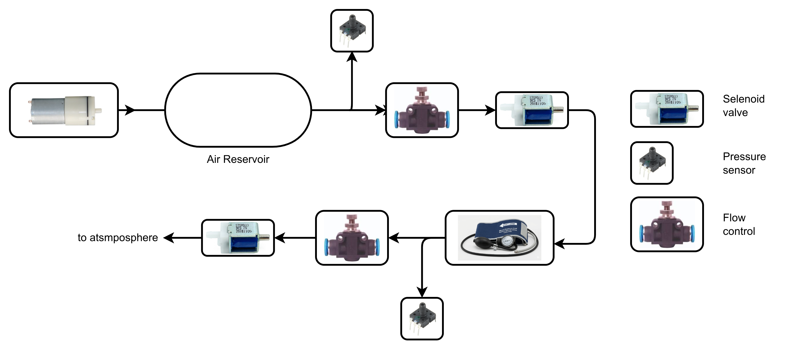

# 🩺 Pressure Control System
> Design and control logic of an automated pneumatic pressure regulation system based on the CuffnCode platform, using an ESP32 microcontroller, pressure sensors, and solenoid valves.

---

## 👥 Team Members

| Name | Student ID |
|------|-----------|
| Zaskia Putri Maesa | 152024070 |
| Valerina Danisa Putri | 152024004 |
| Davina Gizkatri | 152024110 |

---

## 📋 Project Description

This project presents the **design and control logic** of an automated pneumatic pressure control system based on the **CuffnCode platform**, inspired by blood pressure measurement devices (sphygmomanometer / tensimeter).

The ESP32 microcontroller monitors pressure sensor readings and controls the pump and solenoid valves according to predefined pressure thresholds. This repository contains the system analysis, pseudocode, and ESP32 control logic derived from the CuffnCode hardware design.

The system can be applied to:
- Blood pressure monitoring devices
- Pneumatic calibration systems
- Automated inflation/deflation control

---

## 🔧 Hardware Components

| Component | Quantity | Function |
|-----------|----------|----------|
| ESP32 Microcontroller | 1 | Main controller / MCU |
| DC Micro Pump (FF-N20) | 1 | Pumps air into the reservoir |
| Pressure Sensor (MPXV series) | 3 | Reads air pressure at multiple points |
| Solenoid Valve (Input) | 2 | Controls air flow into reservoir |
| Solenoid Valve (Output) | 2 | Releases excess air to atmosphere |
| Flow Control Valve | 2 | Regulates airflow speed |
| Air Reservoir / Cuff | 1 | Stores pressurized air (tensimeter cuff) |

---

## 🔌 Pin Configuration (ESP32)

| ESP32 Pin | Component | Mode |
|-----------|-----------|------|
| GPIO 21 | DC Pump | OUTPUT |
| GPIO 22 | Input Solenoid Valve | OUTPUT |
| GPIO 23 | Output Solenoid Valve | OUTPUT |
| GPIO 34 | Pressure Sensor 1 (main) | INPUT (ADC) |
| GPIO 35 | Pressure Sensor 2 | INPUT (ADC) |
| GPIO 32 | Pressure Sensor 3 | INPUT (ADC) |

> ⚠️ A relay module is required between ESP32 GPIO and the pump/valves since those components operate at 9V, above ESP32's 3.3V GPIO output.

---

## 🗺️ System Design



### Flow Diagram

```
[Pressure Sensors] --> [ESP32 MCU]
                              |
              +---------------+---------------+
              |               |               |
        Pressure < 20   20 <= P <= 80   Pressure > 80
              |               |               |
         FILL MODE       STANDBY MODE    RELEASE MODE
         Pump  = ON      Pump  = OFF     Pump  = OFF
         In V  = ON      In V  = OFF     In V  = OFF
         Out V = OFF     Out V = OFF     Out V = ON
```

---

## 🧠 System Logic

### Pressure Thresholds

| Condition | Threshold | System Response |
|-----------|-----------|-----------------|
| Low Pressure | `P < 20 kPa` | Fill reservoir — Pump ON, Input Valve OPEN |
| Normal / Target | `20 ≤ P ≤ 80 kPa` | Standby — All actuators OFF |
| High Pressure | `P > 80 kPa` | Release air — Output Valve OPEN |

### Control States

**FILL MODE** (Low Pressure)
- DC Pump: `ON`
- Input Solenoid Valve: `OPEN`
- Output Solenoid Valve: `CLOSED`
- Result: Air pumped into reservoir until target pressure reached

**STANDBY MODE** (Normal Pressure)
- DC Pump: `OFF`
- Input Solenoid Valve: `CLOSED`
- Output Solenoid Valve: `CLOSED`
- Result: System holds current pressure, no action needed

**RELEASE MODE** (High Pressure)
- DC Pump: `OFF`
- Input Solenoid Valve: `CLOSED`
- Output Solenoid Valve: `OPEN`
- Result: Excess air vented to atmosphere until pressure returns to normal range

---

## 📊 System Analysis

The system operates in three mutually exclusive modes based on continuous pressure sensor readings:

### 1. Fill Mode (P < 20 kPa)
Activated when pressure drops below the minimum threshold. The pump and input valve are both activated to push air into the reservoir. The output valve remains closed to prevent air from escaping. This mode continues until pressure rises to the normal range.

### 2. Standby Mode (20 kPa ≤ P ≤ 80 kPa)
Activated when pressure is within the target operating range. All actuators are turned off — the system is in a stable hold state. This is the desired operating condition during normal use (e.g. during a blood pressure reading).

### 3. Release Mode (P > 80 kPa)
Activated when pressure exceeds the upper safety threshold. The output solenoid valve opens to vent excess air to the atmosphere. The pump and input valve are kept off to avoid adding more pressure. This mode continues until pressure drops back to the normal range.

### Why 3 Pressure Sensors?
The design uses three sensors placed at different points (pump outlet, cuff/reservoir, and exhaust side) to provide redundancy and allow the MCU to detect pressure differences across the circuit — useful for detecting valve faults or leaks.

---

## 🔁 Simulation Procedure

Since this project is based on analyzing an existing hardware design (CuffnCode), the logic can be simulated as follows:

1. Read pressure sensor values from GPIO 34, 35, and 32
2. Compare readings against predefined thresholds (20 kPa and 80 kPa)
3. Activate pump and valves according to the determined system state
4. Display system status and all sensor values through the Serial Monitor
5. Repeat every 1 second

To simulate on actual hardware:
1. Install **Arduino IDE** and add ESP32 board support via Board Manager
2. Open `pressure_control.cpp`
3. Connect ESP32 via USB → Select board: `ESP32 Dev Module`
4. Select the correct COM port → Click **Upload**
5. Open Serial Monitor at `115200 baud`

---

## 📊 Expected Serial Output

```
--------------------------------------------
Sensor 1 (Primary): 1200  [NORMAL]
Sensor 2           : 1198
Sensor 3           : 1205
Status: STANDBY MODE --> All actuators OFF
Pump: OFF  | Input Valve: CLOSED | Output Valve: CLOSED
--------------------------------------------
```

---

## 📁 File Structure

```
Pressure-Control-System/
│
├── README.md                   ← Project overview and documentation
├── pressure_control.cpp        ← ESP32 Arduino source code
├── pseudocode.txt              ← Human-readable algorithm
├── system_design_analysis.md  ← Component analysis from system diagram
└── system_design.png           ← System design diagram (hardware layout)
```

---

## 📝 Technical Notes

- Pressure values from `analogRead()` are raw ADC values (0–4095 for ESP32 12-bit ADC)
- Raw values must be **converted to kPa** using the sensor's datasheet calibration formula
- Example for MPXV7002DP: `P(kPa) = (Vout / 3.3 - 0.5) / 0.057`
- A **relay module** is required between ESP32 GPIO and pump/valves for voltage compatibility
- A **safety cutoff** should always be implemented at maximum pressure to protect hardware

## 📚 Reference

Original system design adapted from:

> **CuffnCode** — Student Embedded Control and AI Fest  
> https://github.com/Student-Embedded-Control-and-AI-Fest/CuffnCode

*This project was developed for educational purposes as part of an embedded systems course.*

---

*Pressure Control System — Embedded Systems Project | Telkom University*
